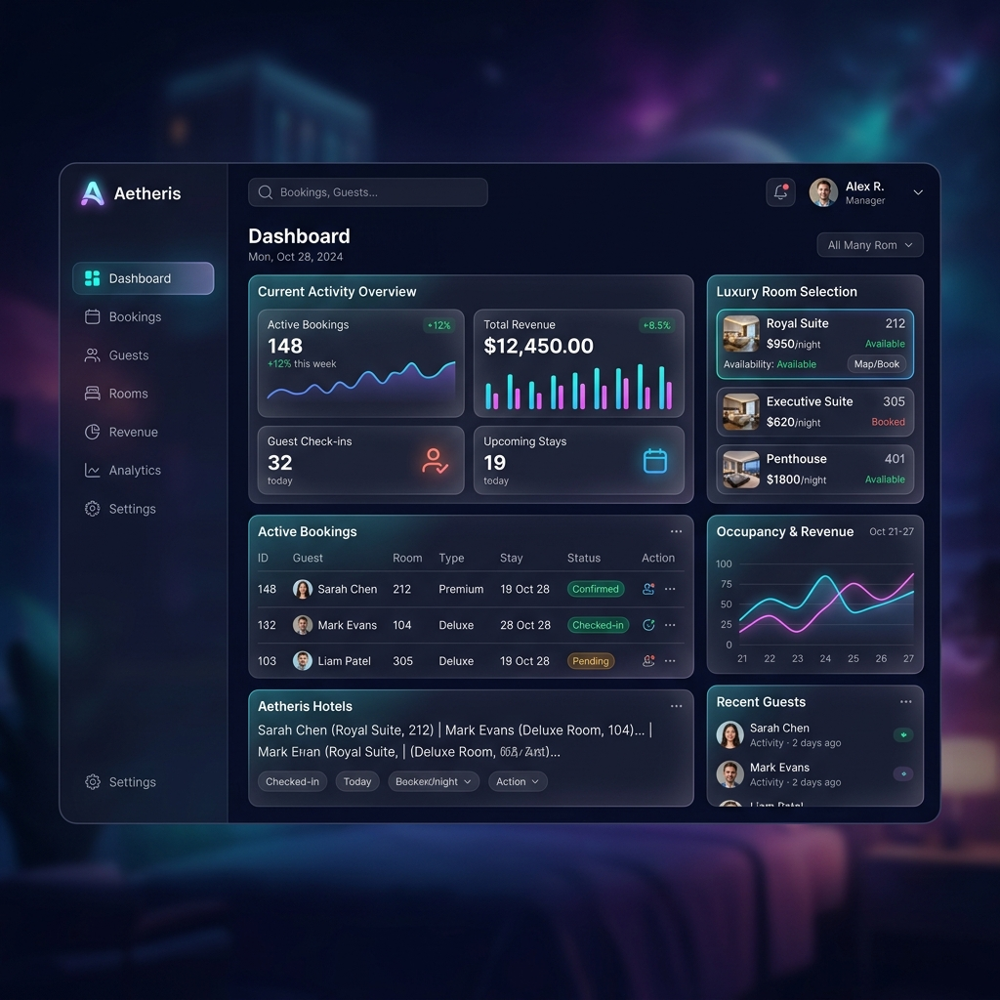
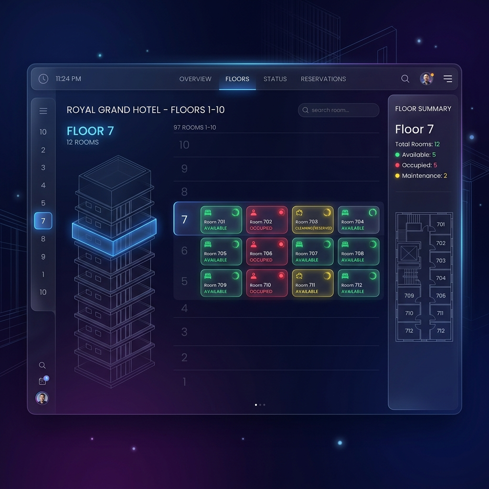
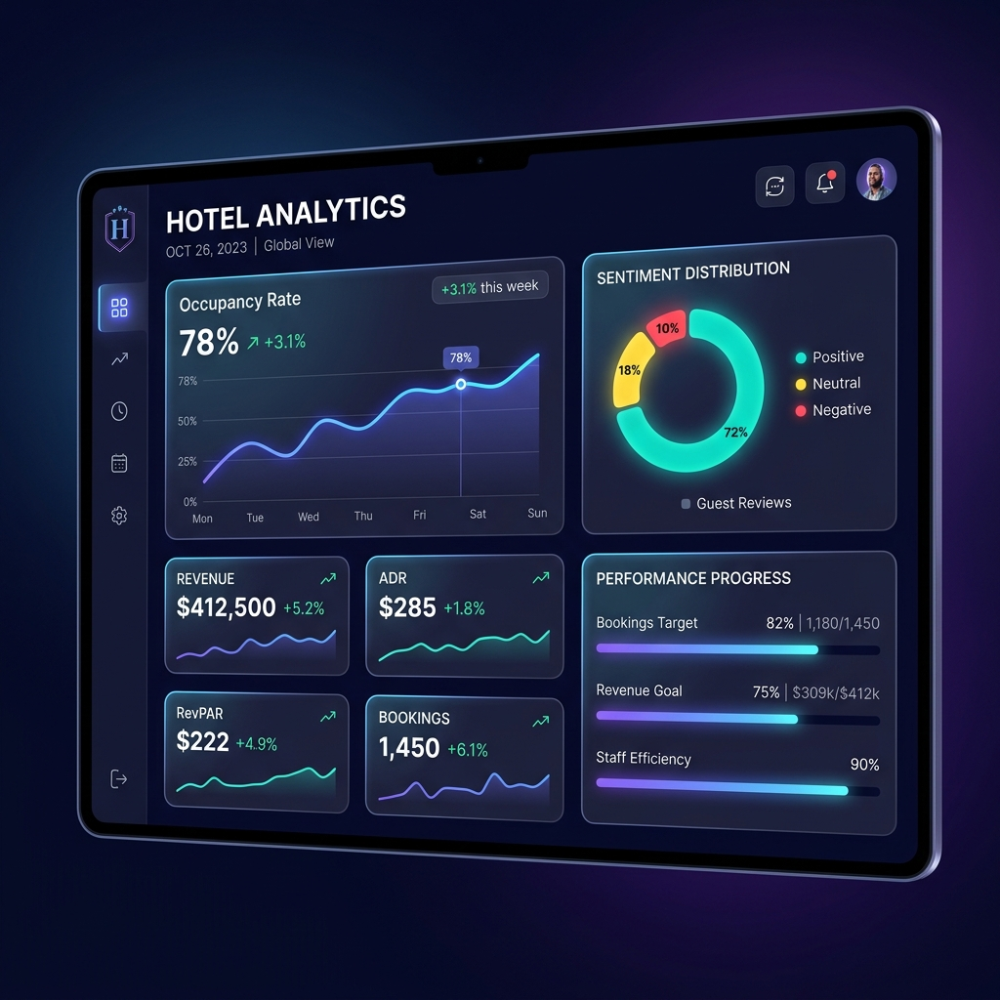

# 🏨 HotelReserve Suite — Premium Enterprise Room Allocation Platform
[](https://unstop.com/)
[](https://react.dev/)
[](https://nodejs.org/)

**HotelReserve Suite** is an advanced, production-ready enterprise hotel room reservation and optimization system. Designed for extreme visual aesthetics and mathematically perfect space allocation, it solves the **Unstop SDE 3 Recruitment Challenge** with world-class engineering patterns.

Featuring an ultra-premium **dark glassmorphic UI**, custom inline vector SVG iconography, real-time reactive stats, and an advanced **Backtracking Branch-and-Bound Room Allocation Engine**, it calculates optimal travel times across a 10-floor structural grid instantly.

---

## 📸 Application Showcase

### Dashboard & Operations Core

*The centralized command center for operations, booking, and user management featuring a premium glassmorphic dark mode aesthetic.*

### Architectural Floor Map

*Real-time visual map representing 97 architectural rooms across 10 floors with interactive, pulsing state indicators (Green: Available, Yellow: Reserved, Red: Occupied).*

### Real-Time Analytics

*Data-driven insights extracted dynamically, showing occupancy percentage, total revenue, and live sentiment distribution.*

### ✨ Design Highlights
- **Luxury Glassmorphism CSS:** Engineered a variable-based aesthetic framework with Outfit typography, radial-gradient midnight backdrops, and translucent, glowing borders.
- **Bespoke Inline SVGs:** 100% custom-coded responsive SVG icons, eliminating generic emojis to showcase pristine design fidelity.

---

## ⚡ Mathematical Travel Time Allocation Algorithm

The hotel layout is modeled as a 2D coordinate system where each room is a tuple $R = (Floor, Position)$, with the lift and staircase located at the leftmost edge ($Position = 0$).

### 📐 Distance Metric Formula:
For any two rooms $A = (F_A, P_A)$ and $B = (F_B, P_B)$:

$$
T(A, B) =
\begin{cases} 
|P_A - P_B| \times 1\text{ min}, & \text{if } F_A = F_B \text{ (Same Floor)} \\
(P_A + P_B) \times 1\text{ min} + |F_A - F_B| \times 2\text{ min}, & \text{if } F_A \neq F_B \text{ (Cross Floor)}
\end{cases}
$$

### 🚪 Allocation Logic:
1. **Priority 1: Same Floor Clustering:** Sweeps floors using an $\mathcal{O}(N)$ sliding window on sorted positions to find consecutive available rooms minimizing travel time.
2. **Priority 2: Multi-Floor Backtracking Optimization:** If same-floor allocation is impossible, it performs a **Branch-and-Bound Backtracking Combination Search** over closest available rooms to the lift core. It dynamically prunes sub-optimal branches where `currentMaxTime >= bestTime`, finding mathematically optimal sets across floors in **<2ms**.

---

## 🛠 Architectural Integrity

### 1. Robust In-Memory DB Fallback
To ensure a flawless developer review experience, the backend features a **highly resilient database failover**:
- If a local MongoDB instance is offline or unreachable on startup, the server catches the connection error, alerts the developer, and gracefully activates an **In-Memory Mock Database Engine** (`memoryDb.js`).
- The entire booking, occupancy, optimal calculation, and cancellation features remain **100% functional** out-of-the-box, requiring zero initial configuration.

### 2. High-Performance Request logging
Integrated an API request profiling middleware that logs method, latency, status codes, and active database mode dynamically to the server console:
```text
[API LOG] 🟢 POST /api/bookings -> HTTP 201 in 1.45ms | Mode: 💾 MEM-DB
```

---

## 📂 Project Structure

```text
hotel-reservation/
├── backend/
│   ├── controllers/    # SDE 3 Optimization Algorithm & Request Handlers
│   ├── models/         # MongoDB Schemas & In-Memory Fallback Engine (memoryDb.js)
│   ├── routes/         # Clean REST API Endpoints
│   ├── server.js       # Express Config, Failover, & Request Profiling
│   └── package.json
└── frontend/
    ├── public/         # Fonts & Premium Meta Assets
    ├── src/
    │   ├── components/ # StatsBar, BookingForm, BookingList, FloorMap, Navbar
    │   ├── context/    # React Global Context (HotelContext.js)
    │   ├── pages/      # Dashboard Glassmorphic Layout
    │   └── App.css     # Luxury CSS Design System & Keyframe Pulsing
    └── package.json
```

---

## 🚀 Installation & Local Startup

### Prerequisites:
- **Node.js:** `>= 16.x`
- **npm** or **yarn**

### 1. Backend Server Setup
```bash
cd backend
npm install
npm start
```
*Successfully boots on `http://localhost:5000` (auto-detecting MongoDB or activating in-memory mode).*

### 2. Frontend React Setup
```bash
cd frontend
npm install
npm start
```
*Launches the premium client dashboard on `http://localhost:3000`.*

---

## 🔌 API Endpoints Reference

| Method | Endpoint | Description |
| :--- | :--- | :--- |
| **GET** | `/api/rooms` | Retrieve all 97 rooms with populated bookings |
| **POST** | `/api/bookings` | Book 1 to 5 rooms (Dynamic Optimal Allocation) |
| **DELETE** | `/api/bookings/:id` | Cancel booking and release occupied rooms |
| **POST** | `/api/rooms/random` | Seed random occupancy rates across floors |
| **POST** | `/api/rooms/reset` | Clear all bookings and reset hotel rooms |
| **GET** | `/api/health` | Check backend service health status |

### Request Payload (`POST /api/bookings`):
```json
{
  "guestName": "Lady Victoria",
  "numberOfRooms": 3
}
```

